# Side Shaper
#### Side Shaper is an audio plugin whose main goal is to make stereo shaping easier.  

---

## Download Folders and First Look
If you're anything like me, you just want the README to shut up and show you where the download files are, so here you go:  
For Windows go to the [https://github.com/DustinMorri/SideShaper/tree/master/Builds/VisualStudio2022/x64/Release](https://github.com/DustinMorri/SideShaper/tree/master/Builds/VisualStudio2022/x64/Release) folder for the SideShaper.vst3 folder.   
For Mac go to the [https://github.com/DustinMorri/SideShaper/tree/master/Builds/MacOSX/build/Release](https://github.com/DustinMorri/SideShaper/tree/master/Builds/MacOSX/build/Release) folder for the SideShaper.component folder.  
For Linux, iOS, or Android, compile the JUCE framework including the Projucer application and then open the SideShaper.jucer file with that application with cmake and then compile this program for your build.  

I also have the LV2 and AAX plugins in the release folders as well thanks to the JUCE framework. Keep in mind that it is never a good idea to blindly trust executable code that has been compiled for you. This is the only official place to find this project. Even though I have provided the prebuilt libraries for Mac, be warned that I have only extensively tested this code on Windows 10 in FL Studios. Please backup your music projects before running this. (You know, while you're at it, you should also backup your whole computer. I'm just saying this to be helpful to non-programmers using GitHub.) This code is provided with no warranties and I reserve the right to switch from the GNU AGPL 3.0 license to the JUCE 9 EULA at any time.  

If you have never used a digital audio workstation before but you still want to try this plugin out and you have a Windows machine, I have included the AudioPluginHost executable in the [https://github.com/DustinMorri/SideShaper/tree/master/Builds/AudioPluginHost](https://github.com/DustinMorri/SideShaper/tree/master/Builds/AudioPluginHost) folder. This executable has only been tested on Windows 10 with an AMD CPU. Download the release VST, go to Options > Edit the List of Available Plug-ins > Options > Scan for new or updated VST3 plug-ins > [Select the folder that is just above the Sideshaper.vst3 folder] > Scan, then go back to the main window and click Plugins > Create Plug-in > VST3 > SideShaper, then connect the Audio Input (Internal) block to the plugin block and then from the plugin block to the Audio Output (Internal) block by clicking and dragging. Sorry this is so complicated.  

This plugin is inspired by FL Studio's Maximus and Fruity WaveShaper built-in plugins.  
The main difference with it is that it focuses mainly on mid/side processing rather than left/right processing.  
It features 2 vectorscopes that allow you to see the before and after effects of shaping, 3 optional linear phase crossovers that can split a signal into 4 frequency bands to target specific parts of your ear, 2 fully parameterized WaveShaper-like sets of sliders to individually control the mid and side values' compression and gain, and a little bit more if you look at the plugin-wide settings.

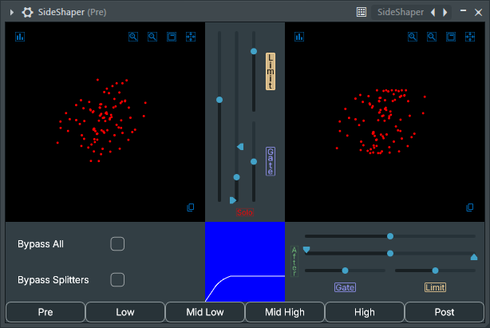  
In this example picture you can see that the mid slider section's parameter values have been altered to give the signal a soft clip.  
Note that changes made on the Pre tab like this are fed into the frequency split tabs.

---

## A Simple Documentation of the Default Settings

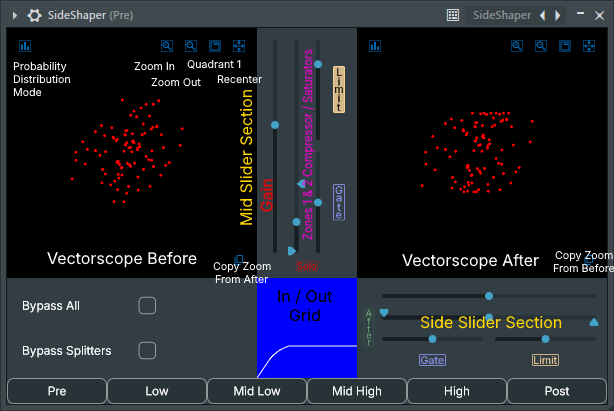  
I have labeled the parts of the plugin here. (I didn't want this ugly picture to be the first thing you saw.)  
The vectorscopes show values -1.0 to 1.0 (the normalized signal) with the x-axis being the Side and the y-axis being the Mid.  
Another way you can think of this is that the top left to bottom right is the left channel and the top right to bottom left is the right channel.  
Note that you can click and drag to transpose the graph center and that you can use your mouse wheel to zoom.  
The In / Out Grid shows values 0.0 to 1.0 with the input values along the x-axis and the output values along the y-axis.  
The In / Out Grid will switch views depending on the last slider you touched.  
Every calculation in this plugin is sample-instantaneous.

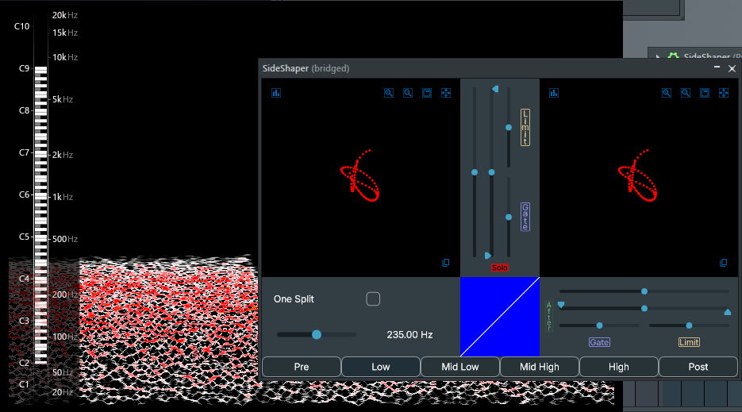  
You can see in this picture that I have switched to the Low tab and that, as a result, the buttons in the bottom left have changed.  
The One Split button allows you to forgo two of the crossovers in case you are processor constrained.  
The slider on the bottom left allows you to change the crossover midpoint frequency between the Low and Mid Low tabs.  
I have also clicked on the solo button just above the in out grid which is why you only see the lower frequencies passing through in the spectrum analyzer.  
How I determine where to set those crossover points depends on how the song sounds in my ear, but, generally speaking,  
the Low tab should target the posterior and anterior cauda helix,  
the Mid Low tab should target the medial and lateral tragus,  
the Mid High tab should target the cymba and cavum concha,  
and the High tab should target the triangular fossa and tubercle for zone 1 and zone 2 respectively.  
I have set the standard minimum and maximum frequencies up to help you do this, but  
you can take more control over the crossover points by looking at the option on the High tab.

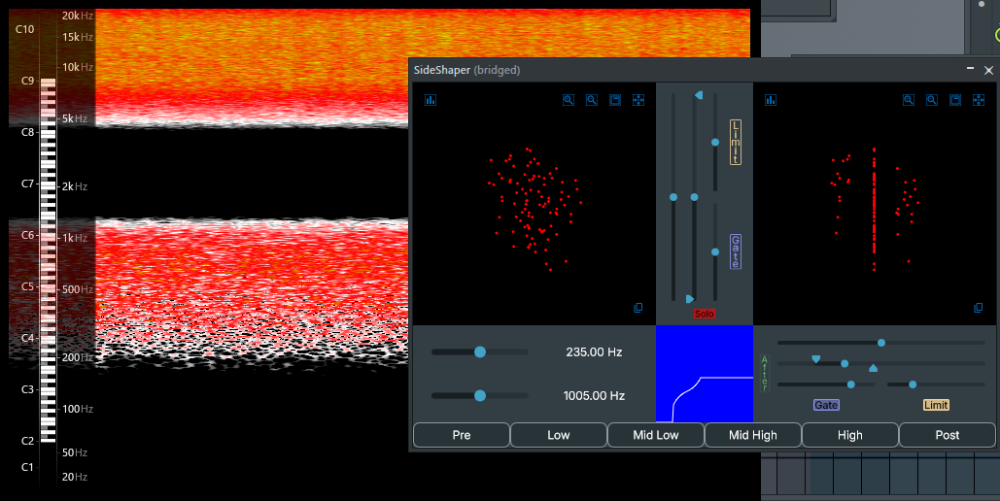  
Note that you can also left click to listen to more than one frequency zone at a time or right click to single a solo out.  
Since I am on the Mid Low tab here, I have the upper frequency slider shown to change the crossover midpoint frequency between the Low and Mid Low tab and the lower frequency slider shown to change the crossover midpoint frequency between the Mid Low and the Mid High tab.  
Just as an example, I have these wacky side parameters set up to explain a little bit more.  
(Although you might be surprised how sometimes something as crazy looking as this might actually sound great.)  
You can see that the side gate is on and that the start distance has been raised, so  
all of the x values on our vectorscope coming in with values between 0.0 and 0.25 will go out as a value of 0.0.  
Notice how the spectrum doesn't really show you how wildly different this sounds.  
X values coming in at 0.25 to 0.5 will be saturated at first (in zone 1 between 0.25 and 0.375)  
and then they will be compressed afterwards (in zone 2 between 0.375 and 0.5).  
After 0.5, the values will remain at 0.5 because the limiter is on as well.  
If you want this same test file, look in the Images/README folder for the stereo_noise.mp3.  

---

## Settings
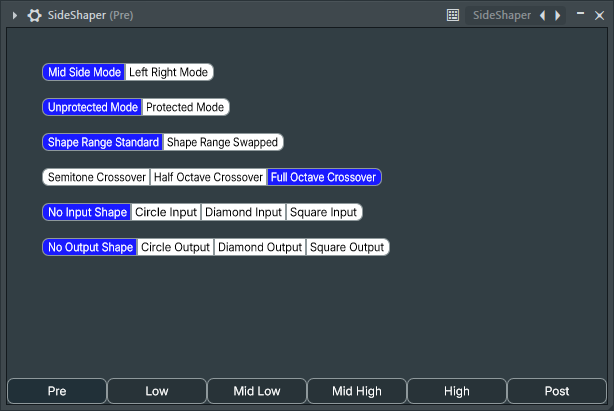  

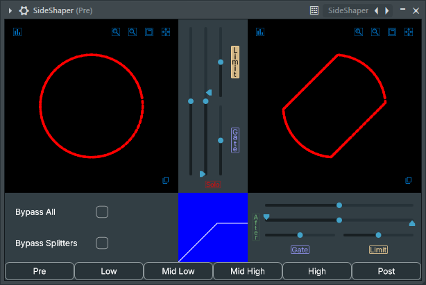  
In "Left Right Mode", the mid slider section operates on the left channel, and the side slider section operates on the right channel.  
 
 
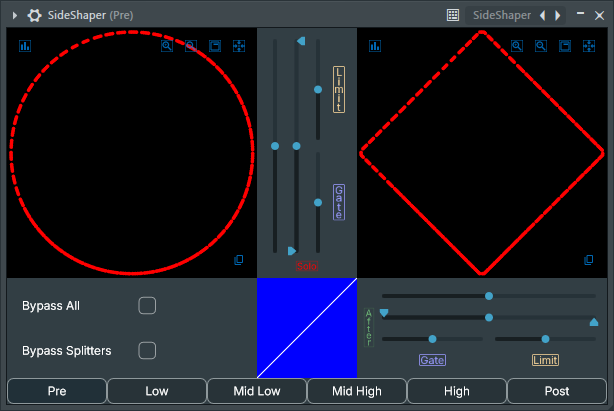  
In "Protected Mode", the left and right channel values will not exceed values of -1.0 and 1.0.  
Notice how mid and side values (aka x and y values on the vectorscope) are still within their respective -1.0 to 1.0 values in "Unprotected Mode".  
 
 
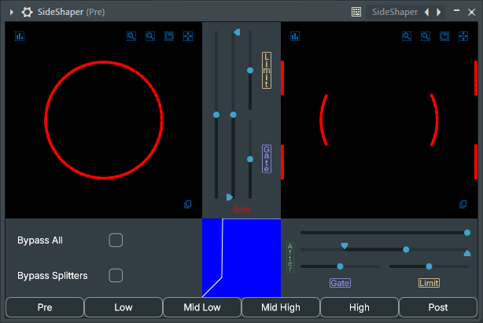  
With the "Shape Range Swapped" setting, the start distance and end distance are compared to the values of the opposite axis.  
You can see in the picture that the inflection point value is at 1.0 for the side shaper, but that the shaping is only applied to samples with a mid value greater than 0.25 (the start distance).  
You can use this in conjunction with multiple instances of the plugin to intentionally get zero values for specific ranges of samples to use in additive synthesis.  
Say that you want to saturate the side values, but only when the mid values are near their peaks.  
You can run this daisy chain of plugins to have a separate mixing channel you can add in.  
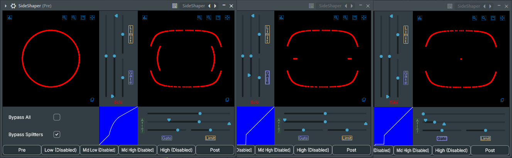  
 
 
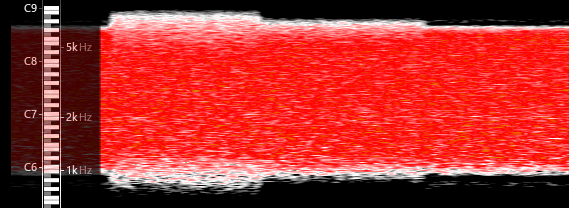  
The "Full Octave Crossover" means that the frequency zone filters rolloff -70dB in one octave so that the blend between zones is more or less seamless.  
The "Half Octave Crossover" and "Semitone Crossover" settings rolloff much quicker.  
 
 
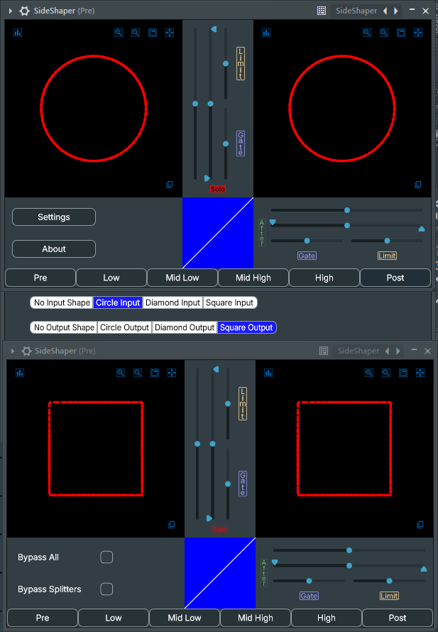  
The last two settings use ray tracing to assert a simple input shape and a desired output shape.  
You can use this to correct signals that have been overcompressed or hard limited.  
You can also use this to get some pretty interesting electronic sounds.  

---

## Credits

The inspiration for this plugin was taken from FL Studios' Maximus plugin, magazines on audio engineering, and the song Simulation by Virtual Riot. I did the first mockup of this plugin in FL Studios' Patcher plugin which is a great sandbox for learning, but it gets unwildly quickly. The second mockup I did was in the Formula VST plugin which is a really cool plugin. I would like to give credit to the JUCE C++ programming framework. JUCE steered me in a lot of really good design directions, but it has all the same encapsulation problems that all middleware does.   I would also like to give credit to Google Gemini. It really helped me out a few times when I was struggling with the math and in the times when the JUCE documentation and examples just didn't even come close to explaining things. I used it about as much as I used Stack Overflow when I made my first plugin about 5 years ago, and, just like with using Stack Overflow, sometimes it really led me down the wrong debugging trails. All of this code was, at the very least, typed by hand. Whether you're running on the order of gigahertz or kilohertz, I hope this plugin makes your day a little bit better :). Thanks for reading the readme.